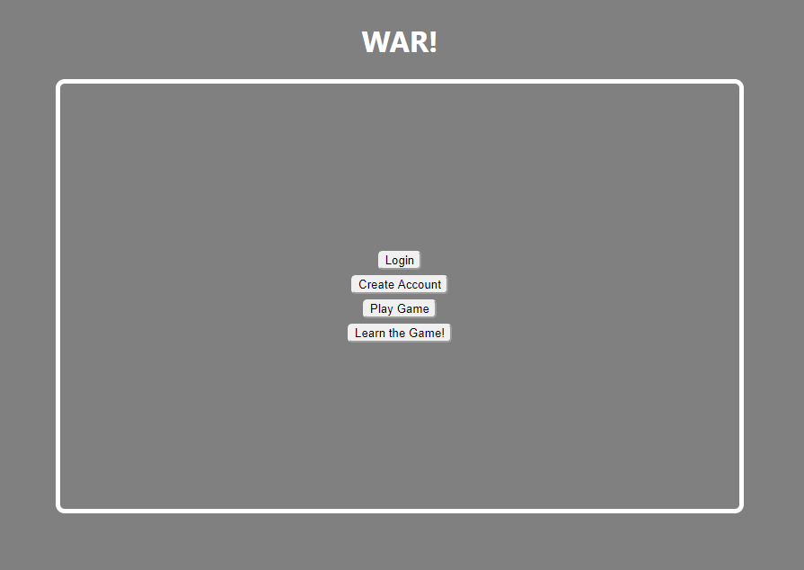
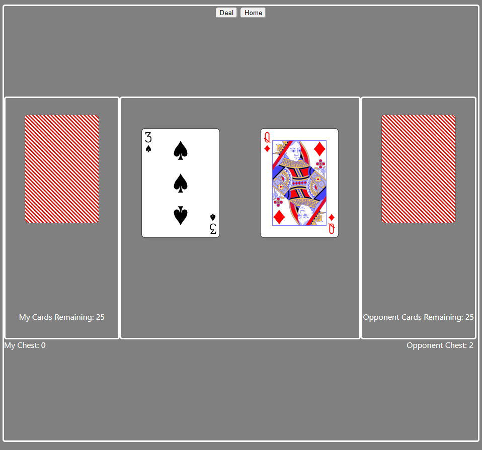

# WAR
https://michael-war-app.now.sh/

It's the childhood game you know and love(or didn't love)!

The game is simple: flip a card against an opponent and whoever has played the higher card wins both of them.

The game is completed by completely running your opponent out of cards, so those aces are a precious commodity!

The tech stack for this project includes the following technologies:
  > Front-End: Html, CSS, Javascript, ReactJS
  
  > Back-End: NodeJS, Express, Knex, PostreSQL

This front end file contains all components, routes, and services pertaining to the client side War application.  It contains the following main components:

> Table (Game)

The Table component is really where all of the magic happens.  It contains the framework for the game, and has subcomponents representing the decks and playing field and calls the service functions that receive data from the API.

> Login

This component handles the form information to be sent to the API in order to authenticate.

> Create-Account

This component simply takes user input in a form and posts it to the api.

## Coming Soon!
> Statistics Features
> Additional Game Modes (in a while)
